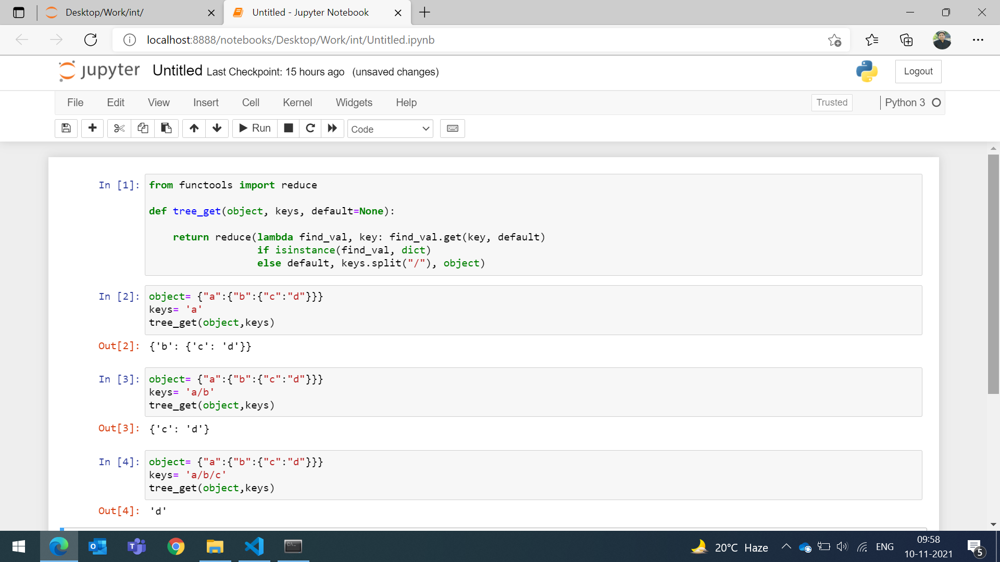
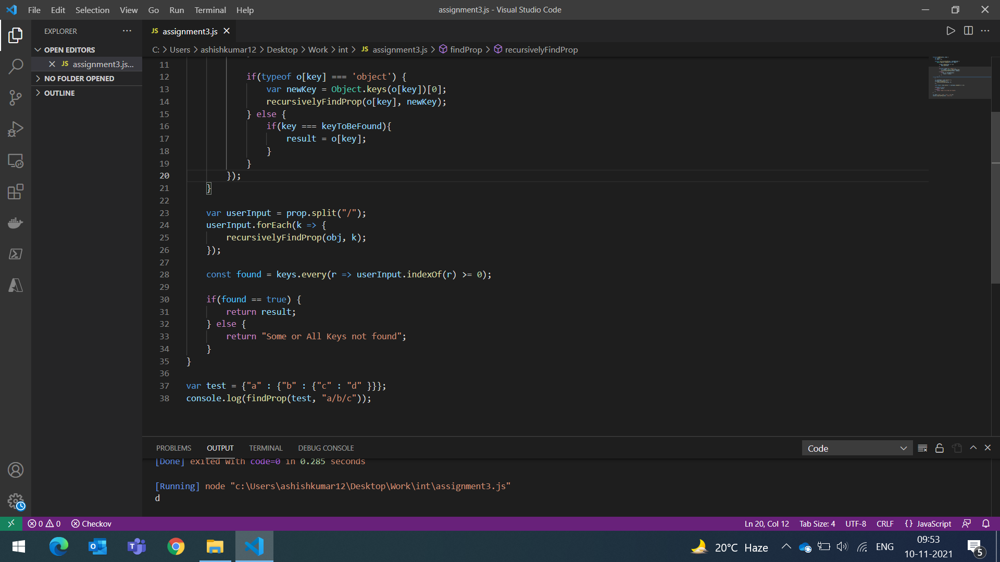

# Challenge #3

We have a nested object, we would like a function that you pass in the object and a key and get back the value. How this is implemented is up to you.
```
Example Inputs
object = {“a”:{“b”:{“c”:”d”}}}
key = a/b/c

object = {“x”:{“y”:{“z”:”a”}}}
key = x/y/z
value = a
```
# Solution

Python Way-
--------------

```
from functools import reduce

def tree_get(object, keys, default=None):
    
    return reduce(lambda find_val, key: find_val.get(key, default) 
                  if isinstance(find_val, dict)
                  else default, keys.split("/"), object)


object= {"a":{"b":{"c":"d"}}}
keys= 'a'
tree_get(object,keys)
```

Output-
-------




JavaScript Way-
------------------

```
function findProp(obj, prop) {
	var result;
	var keys = [];
	
	function recursivelyFindProp(o, keyToBeFound) {
		Object.keys(o).forEach(function (key) {
			
			if(keys.indexOf(key) == -1){
				keys.push(key);
			}
			
			if(typeof o[key] === 'object') {
				var newKey = Object.keys(o[key])[0];
				recursivelyFindProp(o[key], newKey);
			} else {
				if(key === keyToBeFound){
					result = o[key];
				}
			}
		});
	}
	
	var userInput = prop.split("/");
	userInput.forEach(k => {
		recursivelyFindProp(obj, k);
	});
	
	const found = keys.every(r => userInput.indexOf(r) >= 0);
	
	if(found == true) {
		return result;
	} else {
		return "Some or All Keys not found";
	}
}

var test = {"a" : {"b" : {"c" : "d" }}};
console.log(findProp(test, "a/b/c"));
```

Output-
--------



